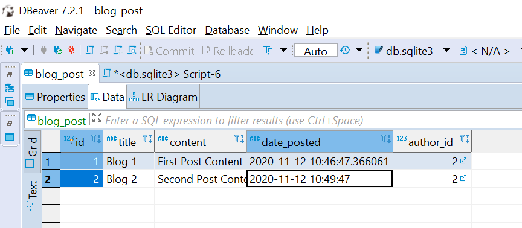
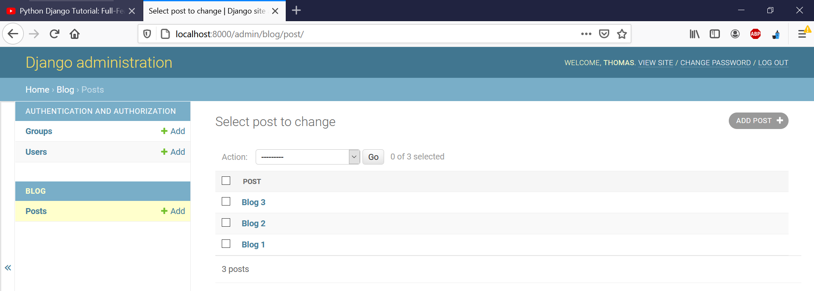

https://www.youtube.com/watch?v=UmljXZIypDc

n.b. on powershell install django `pip install django` from elevated shell

---

**lessons 1,2 - Getting Started**

`python manage.py startapp blog`

`python manage.py runserver`

`django-admin startproject django_project`

---

**lesson 3 - Templates** 

- you should create templates for html
- add apps to `INSTALLED_APPS` in settings.py
- CSS goes into a `static` dir

---

**lesson 4 - Admin**

- Django comes with admin functionality. Saves work on the backend.
- `localhost:8000/admin`
- Before adding a superuser to admin, we need to run `python manage.py makemigrations` followed by `python .\manage.py migrate`
- Now `python .\manage.py createsuperuser` will work. Follow the instructions to create a superuser.

---

**lesson 5 - Datebase and Migrations** 

Django has its own ORM

SQLite in dev, Postgres in prod ???

new tables (classes) go into `models.py`

We can do some queries from the interactive shell `python .\manage.py shell` — see video for detailed demo.

We can also open up a connection to Dbeaver with [./db.sqlite3](./db.sqlite3) and do stuff from there:

If we add `admin.site.register(Post)` to `admin.py` we gain access to admin tools for managing Posts:

